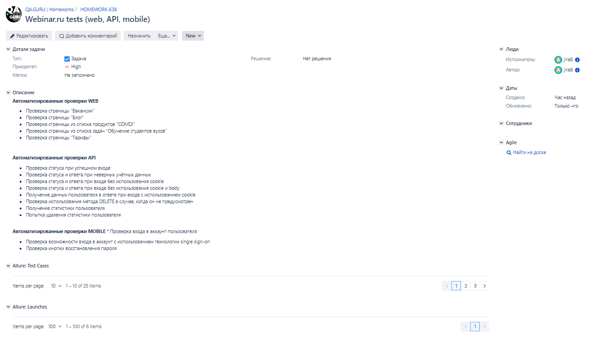

<h1 >Проект автоматизации тестирования для компании <a href="https://webinar.ru/ ">webinar.ru</a></h1>

Тестовый проект состоит из веб-тестов (UI), тестов API и мобильных тестов (Android).

## Содержание

* <a href="#tools">Технологии и инструменты</a>
* <a href="#cases">Реализованные проверки</a>
* <a href="#console">Запуск тестов из терминала</a>
* <a href="#jenkins">Запуск тестов в Jenkins</a>
* <a href="#allure">Отчеты в Allure</a>
* <a href="#testops">Интеграция с Allure TestOps</a>
* <a href="#testops">Интеграция с Jira</a>
* <a href="#telegram">Уведомления в Telegram с использованием бота</a>
* <a href="#video">Пример прогона теста в Selenoid</a>

<a id="tools"></a>
## Технологии и инструменты

<div align="center">
<a href="https://www.jetbrains.com/idea/"></a>
<a href="https://github.com/"></a>  
<a href="https://www.java.com/"></a>
<a href="https://gradle.org/"></a>  
<a href="https://junit.org/junit5/"></a>
<a href="https://selenide.org/"></a>
<a href="https://aerokube.com/selenoid/"></a>
<a href="https://rest-assured.io/"></a>
<a href="https://www.browserstack.com/"></a>
<a href="https://appium.io/"></a>
<a href="https://developer.android.com/studio"></a>
<a href="https://www.jenkins.io/"></a>
<a href="https://github.com/allure-framework/"></a>
<a href="https://qameta.io/"></a>
<a href="https://www.atlassian.com/software/jira"></a>  
<a href="https://telegram.org/"></a>
</div>

Автотесты в этом проекте написаны на Java с использованием фреймворка [Selenide](https://selenide.org/).\
<code>Gradle</code> — используется как инструмент автоматизации сборки.\
<code>JUnit5</code> — для выполнения тестов.\
<code>Selenoid</code> — для удаленного запуска браузера в Docker контейнерах.\
<code>REST Assured</code> — для тестирования REST-API сервисов.\
<code>Jenkins</code> — CI/CD для запуска тестов удаленно.\
<code>Browserstack</code> — для запуска мобильных тестов удаленно.\
<code>Appium</code>, <code>Android Studio</code> — для запуска мобильных тестов локально на эмуляторе мобильных устройств.\
<code>Allure Report</code> — для визуализации результатов тестирования.\
<code>Allure TestOps</code> — как система управления тестированием.\
<code>Jira</code> — как инструмент управления проектом и таск-трекер.\
<code>Telegram Bot</code> — для уведомлений о результатах тестирования.

Allure-отчет включает в себя:
* шаги выполнения тестов;
* скриншот страницы в браузере в момент окончания автотеста;
* Page Source;
* логи браузерной консоли;
* видео выполнения автотеста.

<a id="cases"></a>
## Реализованные проверки

### Автоматизированные проверки WEB
:heavy_check_mark: Проверка страницы "Вакансии" 

:heavy_check_mark: Проверка страницы "Блог"

:heavy_check_mark: Проверка страницы из списка продуктов "COMDI"

:heavy_check_mark: Проверка страницы из списка задач "Обучение студентов вузов" 

:heavy_check_mark: Проверка страницы "Тарифы" 

### Автоматизированные проверки API
:heavy_check_mark: Проверка статуса при успешном входе

:heavy_check_mark: Проверка статуса и ответа при неверных учётных данных

:heavy_check_mark: Проверка статуса и ответа при входе без использования cookie

:heavy_check_mark: Проверка статуса и ответа при входе без использования cookie и body 

:heavy_check_mark: Получение данных пользователя в ответе при входе с использованием cookie 

:heavy_check_mark: Проверка использования метода DELETE в случае, когда он не предусмотрен

:heavy_check_mark: Получение статистики пользователя

:heavy_check_mark: Попытка удаления статистики пользователя

### Автоматизированные проверки MOBILE
:heavy_check_mark: Проверка входа в аккаунт пользователя

:heavy_check_mark: Проверка возможности входа в аккаунт с использованием технологии single sign-on

:heavy_check_mark: Проверка кнопки восстановления пароля

### Ручные проверки
- [ ] Проверка страницы логина на сайте https://events.webinar.ru/signin
- [ ] Проверка email, указанного на странице "Поддержка"


<a id="console"></a>
##  Запуск тестов из терминала
### Локальный запуск тестов
#### WEB

```
gradle clean UI_test 
```

#### API

```
gradle clean api_test 
```

#### MOBILE

```
gradle clean mobile_test -Denv=${ENV}
```

Для запуска мобильных тестов требуется дополнительно определить переменную `env`, с помощью которой
можно переключаться между локальным и удалённым запуском тестов с параметрами по умолчанию. (_`-Denv=mobile_bs` 
для удалённого запуска тестов, `-Denv=emulator` - для локального запуска с помощью эмулятора_).


### Удаленный запуск тестов

```
clean test 
  -Dbrowser=${BROWSER} 
  -DbrowserVersion=${BROWSER_VERSION} 
  -DbrowserSize=${BROWSER_SIZE} 
  -DremoteUrl=${REMOTE_URL}
  -Denv=${ENV}
```

> `${BROWSER}` - наименование браузера (_по умолчанию - <code>chrome</code>_).
> 
> `${BROWSER_VERSION}` - номер версии браузера (_по умолчанию - <code>100.0</code>_).
> 
> `${BROWSER_SIZE}` - размер окна браузера (_по умолчанию - <code>1980x1080</code>_).
>
> `${REMOTE_URL}` - адрес удаленного сервера, на котором будут запускаться тесты.
>
> `${ENV}` - переменная определения среды для запуска мобильных тестов.

### Допустимые комбинации:


<a id="jenkins"></a>
## Запуск тестов в <a target="_blank" href="https://jenkins.autotests.cloud/job/017-Jenny_Ndbn-java-24-webinar-final-project/"> Jenkins </a>

> Сборка с параметрами позволяет перед запуском изменить параметры для сборки (путем выбора из списка или прямым указанием значения).

<p align="center">

</p>

<a id="allure"></a>
## Отчеты в <a target="_blank" href="https://jenkins.autotests.cloud/job/017-Jenny_Ndbn-java-24-webinar-final-project/8/allure/"> Allure report </a> 

### Основное окно

<p align="center">

</p>

### Тесты

<p align="center">

</p>

### Графики

<p align="center">

</p>

<a id="testops"></a>
## Интеграция с <a target="_blank" href="https://allure.autotests.cloud/project/1873/test-cases?treeId=3601"> Allure TestOps </a>   

### Доска
<p align="center">

</p>

### Тест-кейсы
<p align="center">

</p>

### Пример мануального тест-кейса
<p align="center">

</p>


<a id="jira"></a>
## Интеграция с <a target="_blank" href="https://jira.autotests.cloud/browse/HOMEWORK-638"> Jira </a> 
<p align="center">

</p>

<a id="telegram"></a>
## Уведомления в Telegram с использованием бота

<p>

</p>

<a id="video"></a>
## Пример прогона теста в Selenoid

> К каждому web-тесту в отчете прилагается видео
<p align="center">
  
</p>

> В случае запуска мобильного теста с помощью Browserstack к отчету также будет прилагаться видео
<p align="center">
  
</p>
