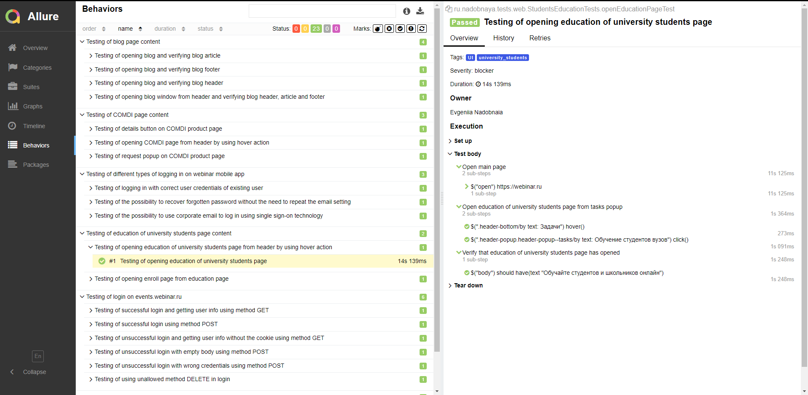
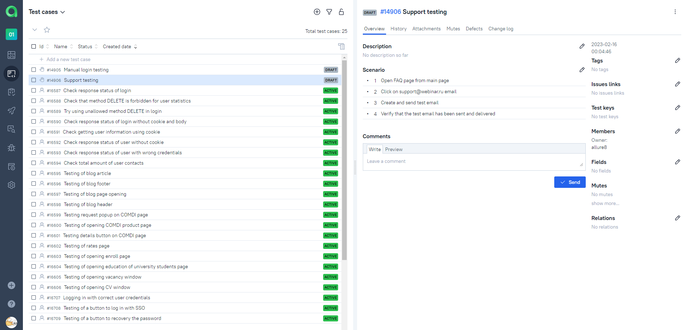

<h1 >Проект автоматизации UI для сайта <a href="https://webinar.ru/ ">webinar.ru</a></h1>

## Содержание

* <a href="#tools">Технологии и инструменты</a>
* <a href="#cases">Реализованные проверки</a>
* <a href="#console">Запуск тестов из терминала</a>
* <a href="#jenkins">Запуск тестов в Jenkins</a>
* <a href="#allure">Отчеты в Allure</a>
* <a href="#testops">Интеграция с Allure TestOps</a>
* <a href="#testops">Интеграция с Jira</a>
* <a href="#telegram">Уведомления в Telegram с использованием бота</a>
* <a href="#video">Пример прогона теста в Selenoid</a>

<a id="tools"></a>
## Технологии и инструменты

<div align="center">
<a href="https://www.jetbrains.com/idea/"></a>
<a href="https://github.com/"></a>  
<a href="https://www.java.com/"></a>
<a href="https://gradle.org/"></a>  
<a href="https://junit.org/junit5/"></a>
<a href="https://selenide.org/"></a>
<a href="https://aerokube.com/selenoid/"></a>
<a href="https://www.jenkins.io/"></a>
<a href="https://github.com/allure-framework/"></a>
<a href="https://qameta.io/"></a>
<a href="https://www.atlassian.com/software/jira"></a>  
<a href="https://telegram.org/"></a>
</div>

Автотесты написаны на <code>Java</code> с использованием <code>JUnit 5</code> и <code>Gradle</code>.
Для UI-тестов использован фреймворк [Selenide](https://selenide.org/).
Запуск тестов можно осуществлять локально или с помощью [Selenoid](https://aerokube.com/selenoid/).
Также реализована сборка в <code>Jenkins</code> с формированием Allure-отчета и отправкой уведомления с результатами в <code>Telegram</code> после завершения прогона.

Allure-отчет включает в себя:
* шаги выполнения тестов;
* скриншот страницы в браузере в момент окончания автотеста;
* Page Source;
* логи браузерной консоли;
* видео выполнения автотеста.

<a id="cases"></a>
## Реализованные проверки

### Автоматизированные проверки
:heavy_check_mark: Проверка страницы "Вакансии" 

:heavy_check_mark: Проверка страницы "Блог"

:heavy_check_mark: Проверка страницы из списка продуктов "COMDI"

:heavy_check_mark: Проверка страницы из списка задач "Обучение студентов вузов" 

:heavy_check_mark: Проверка страницы "Тарифы" 

### Ручные проверки
- [ ] Проверка страницы логина
- [ ] Проверка email, указанного на странице "Поддержка"


<a id="console"></a>
##  Запуск тестов из терминала
### Локальный запуск тестов

```
gradle clean remote_test 
```

С помощью использования переменной `env` можно переключаться между локальным и удалённым запуском тестов с параметрами по умолчанию. (_`-Denv=remote` для удалённого запуска тестов, `-Denv=locale` - для локального_).


### Удаленный запуск тестов

```
clean remote_test 
  -Dbrowser=${BROWSER} 
  -DbrowserVersion=${BROWSER_VERSION} 
  -DbrowserSize=${BROWSER_SIZE} 
  -DremoteUrl=${REMOTE_URL}
```

> `${BROWSER}` - наименование браузера (_по умолчанию - <code>chrome</code>_).
> 
> `${BROWSER_VERSION}` - номер версии браузера (_по умолчанию - <code>100.0</code>_).
> 
> `${BROWSER_SIZE}` - размер окна браузера (_по умолчанию - <code>1980x1080</code>_).
>
> `${REMOTE_URL}` - адрес удаленного сервера, на котором будут запускаться тесты.

<a id="jenkins"></a>
## Запуск тестов в <a target="_blank" href="https://jenkins.autotests.cloud/job/017-Jenny_Ndbn-java-14-webinar-project/"> Jenkins </a>

> Сборка с параметрами позволяет перед запуском изменить параметры для сборки (путем выбора из списка или прямым указанием значения).

<p align="center">

</p>

<a id="allure"></a>
## Отчеты в <a target="_blank" href="https://jenkins.autotests.cloud/job/017-Jenny_Ndbn-java-14-webinar-project/allure/"> Allure report </a> 

### Основное окно

<p align="center">

</p>

### Тесты

<p align="center">

</p>

### Графики

<p align="center">

</p>

<a id="testops"></a>
## Интеграция с <a target="_blank" href="https://allure.autotests.cloud/project/1873/test-cases?treeId=3601"> Allure TestOps </a>   

### Доска
<p align="center">

</p>

### Тест-кейсы
<p align="center">

</p>

### Пример мануального тест-кейса
<p align="center">

</p>


<a id="jira"></a>
## Интеграция с <a target="_blank" href="https://jira.autotests.cloud/browse/HOMEWORK-533"> Jira </a> 
<p align="center">

</p>

<a id="telegram"></a>
## Уведомления в Telegram с использованием бота

<p>

</p>

<a id="video"></a>
## Пример прогона теста в Selenoid

> К каждому тесту в отчете прилагается видео
<p align="center">
  
</p>
